# Minitalk

### 🏆 **42 Project**

**Minitalk** es un proyecto diseñado para demostrar habilidades en comunicación entre procesos utilizando señales de UNIX. Implementa un sistema de cliente-servidor en el que el cliente envía mensajes al servidor, que luego los muestra en la salida estándar.

---

## 🎯 **Objetivo del proyecto**

El objetivo principal de este proyecto es crear un programa cliente-servidor que utilice señales para intercambiar datos. El cliente transmite un mensaje de texto al servidor, que reconstruye y muestra el mensaje con precisión.

---

## 🚀 **Características principales**

1. **Comunicación basada en señales:**
   - Uso de `SIGUSR1` y `SIGUSR2` para enviar y recibir datos bit a bit.
   
2. **Codificación ASCII:**
   - Permite la representación de texto alfanumérico, caracteres especiales y de control.

3. **Fiabilidad:**
   - Implementación robusta que asegura la transmisión correcta de datos bit a bit.

4. **Reconocimiento de mensajes (bonus):**
   - El servidor envía señales de confirmación al cliente para garantizar la recepción correcta.

---

## 📁 **Estructura del proyecto**

```bash
cliente
├── server.c      # Código fuente del servidor
├── Makefile      # Herramienta de compilación
├── libft/        # Biblioteca auxiliar (si es necesaria)
└── README.md     # Este documento
```

---

📖 **Funcionamineto tecnico**

### Cliente

1. Convierte cada carácter del mensaje en una representación binaria.
2. Envía cada bit del mensaje al servidor mediante señales:
   - **SIGUSR1**: Representa el bit `0`.
   - **SIGUSR2**: Representa el bit `1`.
3. Espera confirmación del servidor antes de continuar con el envío del siguiente bit.

### Servidor

1. **Recepción de señales**:
   - Detecta cada señal recibida (SIGUSR1 o SIGUSR2) y convierte los bits en datos binarios.
2. **Reconstrucción del mensaje**:
   - Agrupa los bits en bytes (8 bits por carácter).
   - Reconstruye el mensaje completo almacenándolo en memoria.
3. **Visualización del mensaje**:
   - Muestra el mensaje reconstruido en la salida estándar.
4. **Confirmación**:
   - Envía una señal de vuelta al cliente para confirmar la recepción de cada bit, asegurando la sincronización.

---
### 📊 Diagrama de Flujo

```mermaid
sequenceDiagram
    Cliente->>Servidor: Envía señal (SIGUSR1/SIGUSR2)
    Servidor->>Servidor: Procesa bit recibido
    Servidor->>Cliente: Envía confirmación (SIGUSR1)
    Cliente->>Servidor: Envía siguiente bit
    Servidor->>Salida estándar: Muestra el mensaje reconstruido
```



## 🛠️ **Instrucciones de instalación**

1. Clona el repositorio:
   ```bash
   git clone https://github.com/tuusuario/Minitalk.git && cd Minitalk
   ```

2. Compila el proyecto:

   ```bash
   make
   ```

## 💻  **Como usar**

1. **Iniciar el servidor en una terminal:**
   ```bash
   ./server

2. **Iniciar el cliente en otra terminal:**
   ```bash
   ./client [server_pid] "mensaje"

Reemplaza [server_pid] con el PID del servidor y "mensaje" con el texto a enviar.

3. El servidor debería mostrar el mensaje recibido en la salida estándar.